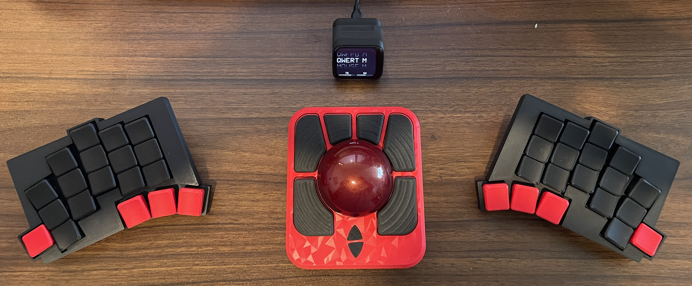
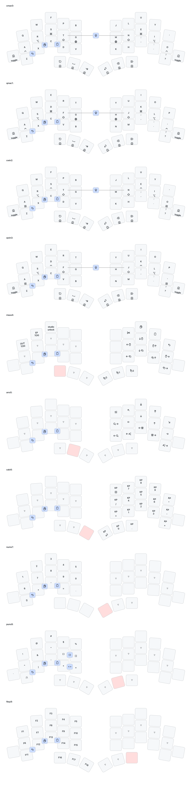

# zmk-totem-prospector-studio-adept

Backup of my working zmk config for:
* Prospector dongle (central)
* Totem wireless split keyboard (peripherals 1 and 3)
* Ploopy Adept trackball with BLE/ZMK mod (peripheral 2)
* with zmk studio support.

To Do: Edit keymap and tweak settings for trackball.

Standing on the Shoulders of work by:
* [GEIST](https://github.com/GEIGEIGEIST/zmk-config-totem)
* [manna-harbour](https://github.com/manna-harbour/miryoku)
* [Townk](https://github.com/Townk/zmk-config)
* [Eigatech](https://github.com/eigatech/zmk-config/tree/totem-prospector)
* [Taichan](https://github.com/taichan1113/mouse-test/tree/main)
* [Ergomech](https://github.com/ergomechstore/sofle-hybrid-ergomech-zmk/tree/test_mouse)

